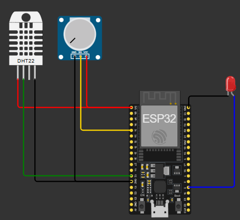

# 🌐 Wellsess - Sistema IoT Corporativo

Sistema de monitoramento ambiental corporativo utilizando **ESP32** para coletar dados de temperatura, umidade e nível de estresse, enviando informações para uma **API REST**.

---

## 👥 Equipe

| RM | Nome | Função Principal |
|----|------|------------------|
| 560179 | Lucas da Ressurreição Barbosa | Java Backend & IoT Integration |
| 559210 | Ranaldo José da Silva | DevOps, QA & Mobile |
| 560694 | Fabrício José da Silva | Oracle Database & .NET |

---

## 📋 Descrição do Projeto

Sistema IoT desenvolvido para monitorar condições ambientais em ambientes corporativos, proporcionando dados importantes para análise de bem-estar e produtividade.



---

## 🛠️ Componentes Utilizados

- **ESP32** – Microcontrolador principal  
- **Sensor DHT22** – Leitura de temperatura e umidade  
- **Potenciômetro** – Simulação do sensor de estresse  
- **LED interno** – Feedback visual  

---

## 🔌 Esquema de Ligação

| Componente     | Pino ESP32 |
|----------------|------------|
| DHT22          | GPIO 12    |
| Potenciômetro  | GPIO 34    |
| LED interno    | GPIO 2     |

---

## 📡 Funcionalidades

- ✅ Leitura de temperatura e umidade  
- ✅ Monitoramento de nível de estresse (simulado)  
- ✅ Conexão Wi-Fi automática  
- ✅ Envio de dados para API REST  
- ✅ Fallback com dados simulados  
- ✅ Feedback visual via LED  
- ✅ Logs detalhados no Serial Monitor  

---

## 🚀 Como Usar

### 1️⃣ Clone o repositório

```bash
git clone https://github.com/seu-usuario/wellsess-iot.git
```

### 2️⃣ Abra o projeto

Compatível com Wokwi ou Arduino IDE
Arquivo principal: sketch.ino

### 3️⃣ Configuração

Conexão Wi-Fi automática para a rede Wokwi-GUEST
Envio de dados para endpoint na Railway

### 4️⃣ Monitoramento

Abra o Serial Monitor (115200 baud) e acompanhe:

- Dados coletados
- Envio para API
- Logs e diagnósticos

### 🔧 Estrutura do Código
Configurações principais

```bash
#define DHT_PIN 12
#define POT_PIN 34

const char* API_URL = "https://gs-welless-production.up.railway.app/api/dados-iot";
const int CHECKIN_ID = 11;
```

### 📊 Dados Coletados

- Temperatura (°C) – DHT22
- Umidade (%) – DHT22
- Nível de Estresse (1-10) – Potenciômetro
- Timestamp – Momento da coleta
- Status do Sensor – Real ou simulado

### 🔄 Fluxo de Operação

- Inicializa sensores e conexão Wi-Fi
- Valida funcionamento do DHT22
- Loop a cada 30 segundos:
- Coleta dados
- Envia para API Wellsess
- Feedback visual via LED
- Registro no Serial Monitor

### 🛠️ Tecnologias
- ESP32
- Arduino Framework
- DHT22
- HTTPClient
- ArduinoJson
- Railway (Deploy da API)

### Baseado no código do Professor André Tritiack